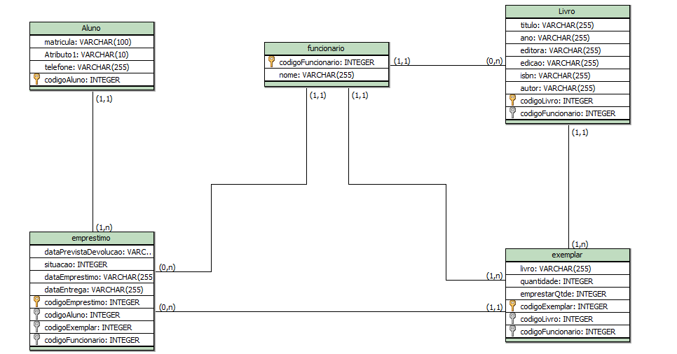
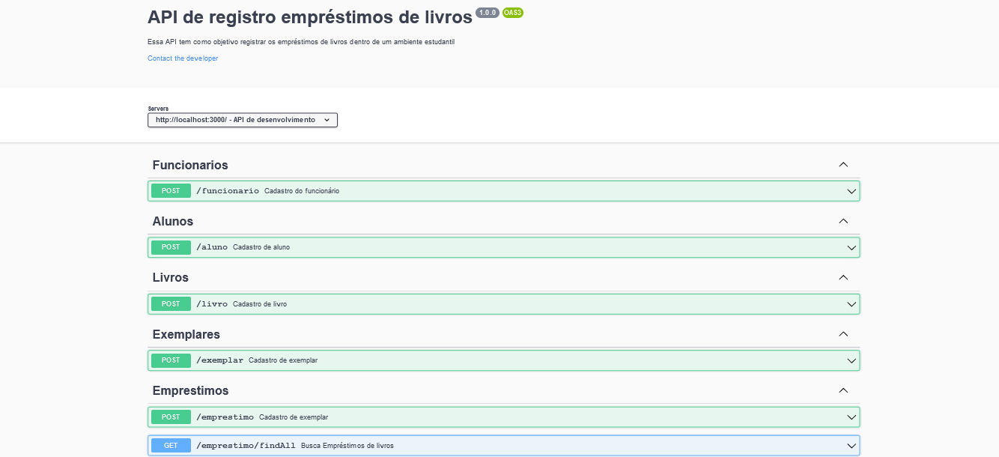

# Registro de livros

**Descrição**, A leitura é de essencial importância no âmbito da educação, pois aumenta o conhecimento aprimora o vocabulário e auxilia na construção textual 
pensando sobre esse contexo foi desenvolvido uma API de um sistema de empréstimo de livros o objetivo é trazer praticidade e acelerar o processo de produtividade nesse ramo da educação.

## Modelagem e definição do digrama de classes UML
<p align="center">
  
</p>

## Tecnologias
- [Express](https://expressjs.com/pt-br/)
- [TypeScript](https://www.typescriptlang.org/)
- [TypeORM](https://typeorm.io/#/)

# Pré requisitos para rodar o projeto.

- Node v14
  - npm ou yarn

# Configurando o projeto para rodar na sua máquina

```shell
# Clonar o projeto
git clone https://github.com/KainanGV/challenge-rt.git

# Entra na pasta do projeto
cd challenge-rt
```

# Executando o projeto

```shell
# Ligando o projeto
yarn dev
```

# Documentação da API
A documentação pode ser acessada atrávez [http://localhost:3000/api-docs](http://localhost:3000/api-docs)

<p align="center">
  
</p>

## Licença

Esse projeto está sob a licença MIT. Veja o arquivo [LICENSE](LICENSE.md) para mais detalhes.

---

By: Kainan Gabriel
